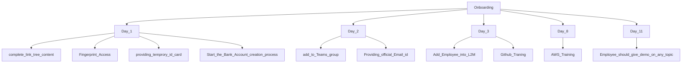

# This is flow chart for Onboarding process

```mermaid
graph TD
Onboarding --> Day_1
Day_1 --> complete_link_tree_content
Day_1 --> Fingerprint_Access
Day_1 --> providing_temprory_id_card
Day_1 --> Start_the_Bank_Account_creation_process
Onboarding --> Day_2
Day_2 --> add_to_Teams_group
Day_2 --> Providing_official_Email_id
Onboarding --> Day_3
Day_3 --> Add_Employee_into_L2M
Day_3 --> Github_Traning
Onboarding --> Day_8 --> AWS_Training
Onboarding --> Day_11 --> Employee_should_give_demo_on_any_topic
```
