# About Mermaid

Mermaid is an open-source JavaScript library that simplifies the creation of various types of diagrams and flowcharts using a straightforward and intuitive text-based syntax. It allows users to generate visually appealing diagrams without the need for specialized software or graphical design skills.

With Mermaid, you can create a wide range of diagrams, including **flowcharts, sequence diagrams, Gantt charts, class diagrams, journey diagrams, Entity-Relationship_Diagrams, PieCharts, Quadrant diagram and more**. Instead of working with complex graphical tools, you write simple code that represents the structure and relationships within your diagrams.

Mermaid diagrams can be rendered in various ways, such as using the Mermaid Live Editor, browser extensions, or plugins for different platforms. This versatility makes it convenient to include interactive and informative diagrams in a variety of contexts, from technical documentation to educational materials and beyond.

Whether you're a developer, designer, educator, or anyone in need of creating clear and visually appealing diagrams, Mermaid offers a user-friendly solution that empowers you to communicate complex ideas with simplicity.

## Flowchart

A flowchart is a visual representation of a process, system, or algorithm using various symbols and connecting lines to illustrate the sequence of steps or actions involved. It's a powerful tool for explaining complex processes in a clear and easy-to-understand manner. Flowcharts are widely used in various fields, including software development, business analysis, project management, and education.

### Key features of a flowchart include:

**Symbols**: Flowcharts use a set of standardized symbols to represent different elements of a process. Some common symbols include:

**Terminator**: Represents the start or end of a process.
**Process**: Represents a specific action or step.
Decision: Represents a branching point where a decision is made based on a condition.
**Input/Output**: Represents data input or output.
**Connector**: Used to connect different parts of the flowchart.
**Arrows or Lines**: Arrows or lines are used to show the flow of control or direction of the process. They connect the symbols in a logical sequence, indicating the order in which steps are performed.

**Sequence**: The sequence of symbols and lines in a flowchart provides a step-by-step depiction of the process. It starts with an initial symbol and progresses through various decisions and actions until it reaches the final symbol.

**Decision Points**: Flowcharts often include decision points where a choice needs to be made based on certain conditions. Depending on the condition's outcome, the flow can take different paths.

**Flow**: The flow of a flowchart can be linear or involve loops and branches. Loops represent repeating steps, while branches allow the process to take different paths based on conditions.

**Annotations**: Text explanations and annotations can be added to the symbols and connecting lines to provide further clarity and context.

## Flowcharts are used for a variety of purposes, such as:

**Software Development**: Flowcharts help visualize the logic and steps involved in algorithms, program structures, and software processes.
**Business Processes**: They aid in documenting and optimizing business workflows and processes.
**Problem Solving**: Flowcharts can assist in identifying and resolving problems by visualizing the steps involved in troubleshooting.
**Educational Purposes**: Flowcharts are valuable tools for teaching and learning complex concepts in an easily digestible format.
**Process Documentation**: They provide a standardized way to document procedures and guidelines.
Creating flowcharts manually can be time-consuming, which is where tools like Mermaid come in. Using Mermaid's simple text-based syntax, you can quickly create and share flowcharts without the need for specialized software. This makes flowcharting accessible to individuals with various technical backgrounds and enhances collaboration and understanding across different disciplines.

## Sequence Diagram

A sequence diagram is a type of diagram used in software development and system analysis to visually represent the interactions and messages exchanged between various components, objects, or actors within a system. It illustrates the chronological sequence of events as they occur during a specific scenario or process.

### Key components of a sequence diagram include:

**Lifelines**: Lifelines represent individual objects or entities participating in the interaction. Each lifeline corresponds to a specific component, object, or actor involved in the sequence.

**Activation Bars**: Activation bars, also known as lifeline activations, depict the time period during which a lifeline is actively processing or responding to messages. They are represented as horizontal bars extending from the lifeline's vertical line.

**Messages**: Messages are the interactions or communications exchanged between lifelines. They can be synchronous or asynchronous. Synchronous messages indicate that the sender waits for a response before continuing, while asynchronous messages don't require an immediate response.

**Self-Call**: A lifeline can send a message to itself, representing internal processing or self-invoked actions.

**Return Message**: After an object processes a message, it might send a return message to the original sender, indicating the completion of the requested action.

**Activation and Deactivation**: Lifelines are activated when a message is sent to them and deactivated when their processing is complete. Activation and deactivation are depicted using the activation bars.

### Sequence diagrams are used for various purposes, including:

**Design and Analysis**: They help designers and analysts visualize the interactions between different components and objects, aiding in system design and requirements analysis.

**Communication**: Sequence diagrams facilitate clear communication among development teams, allowing them to understand the flow of interactions and collaborations.

**Testing**: These diagrams are useful for creating test scenarios and validating the behavior of a system under different conditions.

**Documentation**: Sequence diagrams serve as documentation, illustrating how different parts of a system work together to achieve specific functionality.

**Troubleshooting**: They assist in identifying bottlenecks, delays, or communication issues in a system's interactions.

When using tools like Mermaid to create sequence diagrams, you write the sequence of interactions using a specific syntax. Mermaid then translates this syntax into a visual representation of the interactions, making it easier to include these diagrams in documentation, presentations, and other materials. This approach streamlines the process of creating and sharing sequence diagrams, fostering effective communication and collaboration among team members and stakeholders.

## Journey diagrams

A journey diagram, also known as a customer journey map or user journey map, is a visual representation that illustrates the various touchpoints, interactions, and experiences a user or customer goes through when engaging with a product, service, or process. It provides a holistic view of the user's journey, highlighting key moments, emotions, and pain points along the way.

### Key elements of a journey diagram include:

**Stages**: The journey is typically divided into stages or phases that represent different steps in the user's experience. These stages can include awareness, consideration, purchase, usage, support, and more, depending on the context.

**Touchpoints**: Touchpoints are the interactions between the user and the product or service. These interactions can take various forms, such as visiting a website, using an app, talking to customer support, receiving emails, etc.

**Actions and Emotions**: Each touchpoint is accompanied by the user's actions, thoughts, and emotions. This helps in understanding how the user feels at different points in their journey.

**Pain Points and Delighters**: Pain points represent obstacles, frustrations, or difficulties the user encounters during their journey. Delighters, on the other hand, are positive surprises or moments of joy.

**Channels**: The channels through which interactions take place are identified. This could include digital channels like websites and social media, as well as physical channels like in-person visits or phone calls.

**User Goals**: The user's goals and motivations at each stage are highlighted. This gives insight into what the user is trying to achieve and whether their goals align with the provided experience.

### Journey diagrams are used for several purposes, including:

**User-Centric Design**: They help designers and product teams understand the user's perspective and design products and services that meet user needs effectively.

**Customer Experience Improvement**: By identifying pain points and areas of improvement, businesses can enhance the overall customer experience.

**Communication**: Journey diagrams facilitate communication among teams, aligning them around the user's journey and promoting a shared understanding.

**Innovation**: They can inspire innovation by identifying new opportunities to enhance user experience and provide unique value.

**Decision Making**: Journey diagrams provide insights that guide strategic decisions about product development, marketing, and customer support.

Creating journey diagrams can be done using various tools, including paper and pen, graphic design software, and specialized journey mapping tools. Tools like Mermaid can also be used to create simplified journey diagrams using text-based syntax. This can be especially useful when you want to quickly create and share journey maps within documentation, presentations, or other materials.

## Gantt diagrams

A Gantt diagram, also known as a Gantt chart, is a popular project management tool that provides a visual representation of a project's schedule over time. It displays the timeline of tasks, activities, and milestones involved in a project, making it easier to plan, track progress, and manage resources efficiently.

### Key components of a Gantt diagram include:

**Tasks**: Tasks represent the individual activities or work items that need to be completed as part of the project. Each task is listed along the vertical axis of the chart.

**Timeline**: The horizontal axis of the chart represents the timeline, typically divided into days, weeks, or months. The timeline illustrates when each task begins and ends.

**Bars**: For each task, a horizontal bar is drawn on the chart. The bar's length corresponds to the duration of the task, and its position on the timeline indicates when the task will take place.

**Dependencies**: Dependencies show the relationships between tasks. Some tasks might depend on others being completed before they can start. These relationships are usually depicted using arrows connecting the bars.

**Milestones**: Milestones are significant points in the project that mark its progress or completion of a major phase. They are represented as vertical lines or diamonds on the chart.

**Resource Allocation**: Some Gantt charts also include information about resource allocation, indicating which individuals or teams are responsible for each task.

### Gantt diagrams are used for various project management purposes, including:

**Planning**: Gantt charts help project managers plan the sequence and duration of tasks, ensuring a logical flow of work and efficient resource allocation.

**Scheduling**: By visualizing the timeline and dependencies, Gantt charts assist in creating realistic schedules and identifying potential bottlenecks.

**Progress Tracking**: Project teams can track the progress of tasks by comparing the actual timeline with the planned timeline on the chart.

**Communication**: Gantt charts provide a clear overview of a project's status, making it easy to communicate progress and timelines to stakeholders.

**Resource Management**: The visual representation of tasks and resources helps in managing and optimizing resource allocation.

**Risk Management**: Gantt charts allow project managers to identify potential delays or issues and take corrective actions.

While traditional Gantt charts are often created using specialized project management software, tools like Mermaid offer a text-based way to create simple Gantt diagrams. Mermaid's Gantt syntax allows you to quickly generate Gantt charts within documentation, presentations, and other materials without the need for complex software or design skills. This can be particularly useful for sharing project plans and timelines with team members and stakeholders.

## Git Diagrams

It seems like you might be referring to diagrams that visualize Git workflows and version control processes. Git diagrams can help you understand how branches, commits, merges, and other Git operations work together to manage code changes and collaborate effectively in software development.

### There are several types of diagrams commonly used to illustrate Git workflows:

**Branching and Merging**:

**Feature Branch Workflow**: This shows how feature branches are created from the main branch, changes are made, and then merged back into the main branch.

**Gitflow Workflow**: This demonstrates a more structured approach involving feature, develop, release, and hotfix branches, providing a clear path for feature development and release management.

**Commit History**:

**Git Commit Tree**: This diagram illustrates the commit history of a repository, showing the parent-child relationships between commits.
Pull Requests and Code Reviews:

**Pull Request Workflow**: This illustrates how pull requests are created, reviewed, and merged to integrate changes from one branch to another.
Collaboration:

**Fork and Pull Workflow**: This shows how contributors fork a repository, make changes in their own fork, and then submit pull requests to the original repository.

**Tagging Workflow**: This diagram explains how tags are used to mark specific points in history, such as releases.

# Entity-Relationship Diagram (ERD)

An Entity-Relationship Diagram (ERD) is a visual representation used to model the relationships between entities (objects, concepts, or elements) within a system or database. ERDs provide a clear and structured overview of how different entities interact and relate to each other.

## Key elements of an ERD include:

Entities: Entities represent real-world objects or concepts that have attributes of interest. They can be nouns such as "Customer," "Product," "Order," etc.

**Attributes**: Attributes are properties that describe an entity. For instance, a "Customer" entity might have attributes like "Name," "Email," and "Address."

**Relationships**: Relationships depict how entities are connected to each other. They can be one-to-one, one-to-many, or many-to-many. For example, a "Customer" can place many "Orders," creating a one-to-many relationship.

**Cardinality**: Cardinality defines the number of instances of one entity that can be related to instances of another entity. It's often expressed as minimum and maximum values. For instance, a "Customer" can have a minimum of 0 and a maximum of many "Orders."

**Primary Key**: A primary key is a unique identifier for each instance of an entity. It ensures each entity instance is distinct and can be used to establish relationships.

**Foreign Key**: A foreign key is a reference to the primary key of another entity. It's used to establish relationships between entities.

**Attributes and Relationships Notation**: Different notations are used to represent attributes and relationships in an ERD, such as crow's foot notation, Chen notation, and UML notation.

**Purposes of ERDs include**:
Database Design: ERDs are extensively used in designing relational databases, helping developers structure data tables and define relationships between them.

**Data Integrity**: ERDs aid in maintaining data integrity by ensuring that relationships between entities are correctly established and maintained.

**Communication**: ERDs facilitate communication between database designers, developers, and stakeholders by providing a visual representation of the data model.

**Identifying Redundancy**: ERDs can help identify redundancy in data storage and assist in optimizing database design.

**Database Maintenance**: ERDs serve as documentation for the database structure, making it easier to modify and maintain the database over time.

**Query Design**: ERDs can assist in designing SQL queries and understanding how to retrieve data based on the established relationships.

Creating an ERD can be done using various tools, such as dedicated ERD software like Lucidchart, draw.io, or even diagramming tools within database management systems (DBMS). The choice of notation and tool depends on the specific needs of the project and the preferences of the team involved.

# Class Diagram

A Class Diagram is a type of diagram in the Unified Modeling Language (UML) used to visualize the structure of a system or software application. It represents the classes, their attributes, methods, and relationships between classes.

## Key elements of a Class Diagram include:

**Classes**: Classes represent blueprint templates for objects. They encapsulate data (attributes) and behavior (methods) that objects of the class will exhibit.

**Attributes**: Attributes are properties or characteristics that describe the state of a class. For example, a "Person" class might have attributes like "name," "age," and "address."

**Methods**: Methods are the functions or operations that a class can perform. They define the behavior of the class. For instance, a "Car" class might have methods like "startEngine()" and "accelerate()".

**Associations**: Associations represent relationships between classes. They show how instances of one class are related to instances of another class. Associations can be one-to-one, one-to-many, or many-to-many.

**Multiplicities**: Multiplicities indicate the number of instances involved in an association. They specify the minimum and maximum number of instances that can participate in the relationship.

**Inheritance (Generalization and Specialization)**: Inheritance represents the relationship between a superclass (parent class) and subclasses (child classes). Subclasses inherit attributes and methods from the superclass.

**Aggregation and Composition**: These represent more specific forms of associations. Aggregation is a "whole-part" relationship, while composition implies a stronger "whole-part" relationship where the parts cannot exist without the whole.

**Dependencies**: Dependencies represent the reliance of one class on another class. For example, if one class uses another class as a parameter in its method, there's a dependency between them.

**Purposes of Class Diagrams include**:
Designing Object-Oriented Systems: Class diagrams are fundamental for designing object-oriented software systems, helping developers define classes, their relationships, and interactions.

**Visualization of System Structure**: Class diagrams provide a visual representation of the structure of the system, making it easier to understand the organization of classes and their relationships.

**Documentation**: They serve as a form of documentation for the software design, aiding in communication among developers, designers, and stakeholders.

**Identifying Design Flaws**: Class diagrams can reveal design flaws or inconsistencies in the initial system design, allowing for early detection and correction.

**Code Generation**: Some software development tools can generate code directly from class diagrams, streamlining the development process.

**Analysis**: Class diagrams assist in analyzing the complexity and relationships of a system, supporting decisions about design improvements and optimizations.

Creating Class Diagrams can be done using UML modeling tools like Visual Paradigm, Enterprise Architect, or even simple diagramming tools like draw.io. The choice of tool depends on the complexity of the project and the specific needs of the development team.

# Quadrant Diagram

A Quadrant Diagram is a visual representation that divides a space into four quadrants, each representing a different category, concept, or dimension. Quadrant diagrams are used to analyze and categorize items based on their characteristics and relationships within a two-dimensional framework.

## Key elements of a Quadrant Diagram include:

**Quadrants**: The diagram is divided into four quadrants, typically labeled as Quadrant I, Quadrant II, Quadrant III, and Quadrant IV. These quadrants are used to categorize items based on two dimensions.

**Dimensions**: The two dimensions represent two different attributes, concepts, or variables that define the space. These dimensions can be quantitative, qualitative, or a mix of both.

**Items**: Items or entities are plotted within the diagram based on their values along the two dimensions. The placement of an item in a specific quadrant reflects its position in relation to the defined dimensions.

**Axis Labels**: Each axis is labeled to indicate the specific attributes or concepts being measured along that axis. Clear labels help viewers understand the meaning of each dimension.

**Quadrant Labels**: Each quadrant might be labeled to represent the category or concept associated with that quadrant. These labels provide context for interpreting the relationships between items.

## Purposes of Quadrant Diagrams include:

**Categorization and Analysis**: Quadrant diagrams allow for the categorization and analysis of items based on two dimensions, revealing patterns, trends, and relationships between the items.

**Decision Making**: Quadrant diagrams provide a structured framework for making decisions by visually organizing information into distinct categories.

**Prioritization**: Items plotted in different quadrants can be prioritized based on their positions. This helps in identifying high-priority items and areas for improvement.

**Risk Assessment**: Quadrant diagrams can be used to assess risks by plotting potential risks based on their impact and likelihood.

**Portfolio Management**: In business and project management, quadrant diagrams can be used to manage portfolios of products, projects, or investments.

**Comparative Analysis**: By comparing items' positions in different quadrants, insights can be gained about relative strengths and weaknesses.

**Communication**: Quadrant diagrams provide a visual and concise way to communicate complex information and relationships to stakeholders.

Creating Quadrant Diagrams can be done using various tools, including graphic design software like Adobe Illustrator, presentation software like Microsoft PowerPoint or Google Slides, or even specialized visualization tools like Tableau or Power BI. The choice of tool depends on the complexity of the diagram and the preferred format for sharing with the intended audience

# Pie Chart

A Pie Chart is a circular statistical graphic that is divided into slices to represent the proportions of different categories within a whole. Each slice's size is proportional to the value it represents, allowing for easy visualization of the distribution of data.

## Key elements of a Pie Chart include:

**Slices**: Slices are the individual segments of the pie that represent different categories or data points. The size of each slice corresponds to the proportion of the whole that it represents.

**Categories or Data Points**: Each slice is associated with a specific category or data point that is being represented. These categories are often labeled on or near their corresponding slices.

**Labels**: Labels are text annotations associated with each slice, indicating the name or value of the category it represents. Labels help viewers understand the significance of each slice.

**Legend**: A legend is a key that explains what each slice of the pie represents. It's particularly useful when the pie chart has many slices or when labels could be cluttered.

**Total Value**: The total value or sum of all the values being represented in the pie chart is crucial, as it represents the whole pie.

## Purposes of Pie Charts include:

Data Distribution: Pie charts are used to visually represent the distribution of data within various categories or segments of a whole.

**Proportions**: They allow viewers to quickly assess the proportions of each category relative to the whole.

**Comparison**: Pie charts enable comparison between different categories based on their sizes, highlighting which categories are larger or smaller in relation to each other.

**Simplicity**: Pie charts provide a simple and intuitive way to represent data, making them suitable for conveying basic relationships between categories.

**Percentage Representation**: Pie charts provide a clear representation of the percentage that each category contributes to the whole.

**Limitations Awareness**: While pie charts are useful for showing relative proportions, they can become less effective if there are too many categories or if the differences in values are small.

**Visual Engagement**: Pie charts can engage audiences and make data more accessible and visually appealing.

Creating Pie Charts can be done using various tools, including spreadsheet software like Microsoft Excel or Google Sheets, data visualization tools like Tableau or Power BI, or even programming languages like Python with libraries like Matplotlib or Plotly. When creating a pie chart, it's important to ensure that the data is well-organized and that the chart's design is clear and easily understandable for the intended audience.
